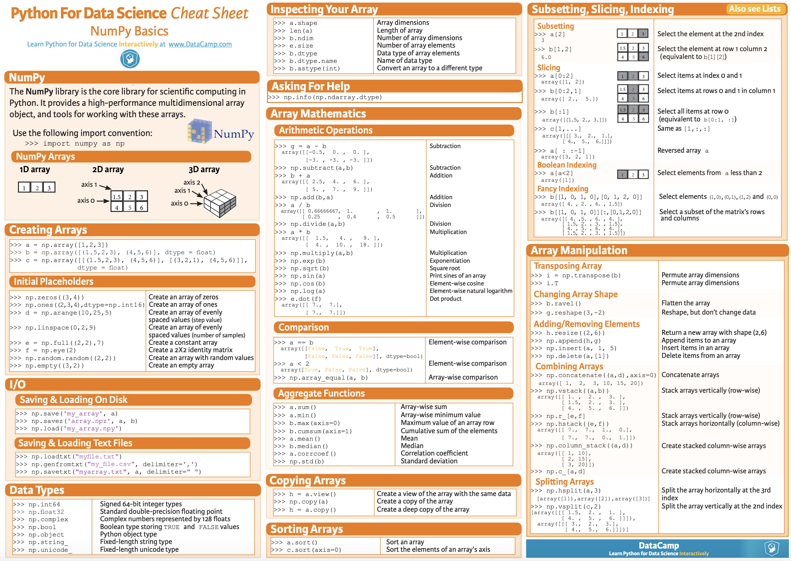

# NumPy
>  [Numpy](http://www.numpy.org/)  : 파이썬이 선형대수학과 같은 계산과학분야에 이용될때 핵심 역할을 하는 라이브러리입니다. Numpy는 고성능의 다차원 배열 객체와 이를 다룰 도구를 제공하므로써 기존보다 훨씬 빠르게 자료를 처리할 수 있게 도와줍니다.

## Before Lecture Start
```python 
import numpy as np
```

 본 강의에서는 위와 같이 NumPy 라이브러리를 `np`라는 단어로 축약하여 부를 예정입니다. 이 점 확인하시길 바랍니다.

## Table of Contents
각 강의는 이론과 실습이 함께 구성되어 있는 `jupyter notebook`형식입니다. 눈으로 확인하는 것보다 직접 실습하시는걸 추천드립니다. `Python`이 설치되어있지 않으신 분들은 `Google Colab`으로 실습하실 수 있습니다.

1. NumPy **Basic**
	* 기초적인 자료형 
2. NumPy **Creation**
	- np.zeros, np.ones
3. NumPy **Reshaping**
	- np.reshape
4. NumPy **Operations**
5. NumPy **Random**
6. NumPy **Slicing**
7. NumPy **Broadcasting**

## NumPy Cheat Sheet



## Reference
- https://www.intel.com
- https://numpy.org/
- https://github.com/rougier/numpy-tutorial
- https://github.com/rougier/numpy-100
- http://aikorea.org/cs231n/python-numpy-tutorial/
- http://riseshia.github.io/2017/01/30/numpy-tutorial-with-code.html
- 
